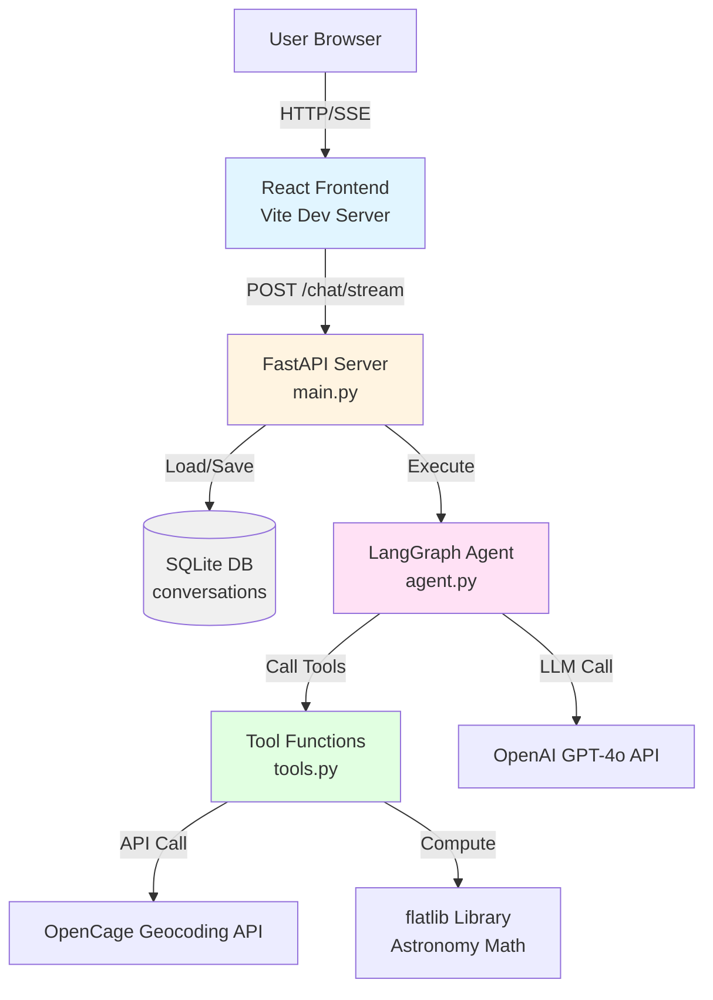
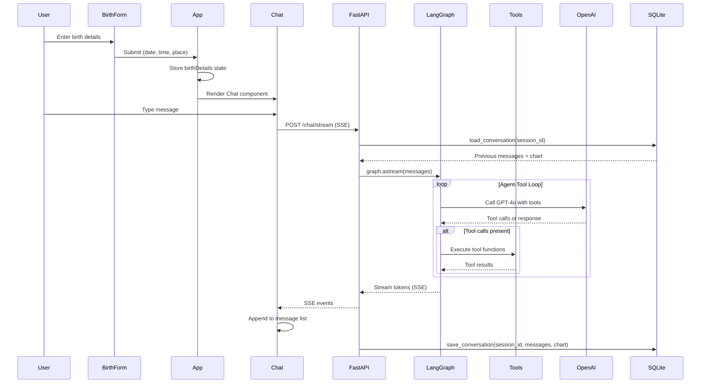
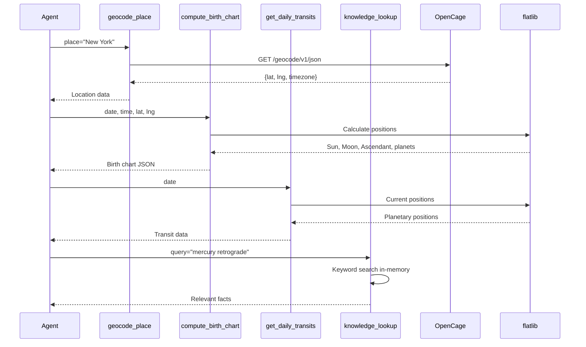

# Design Document: AstroAgent - AI Astrology Chatbot

## Overview

AstroAgent is a full-stack AI-powered astrology chatbot that provides personalized astrological guidance. Users input their birth details (date, time, place), and the system computes their natal birth chart using real astronomical calculations. An AI agent powered by GPT-4o and LangGraph provides conversational astrological insights by accessing tools for geocoding, chart computation, daily transits, and astrology knowledge lookup. The system uses a minimal tech stack (Python FastAPI backend, React frontend, SQLite persistence) with strict constraints: maximum 10 files, no heavy infrastructure, single .env configuration.

## Architecture



## Sequence Diagrams

### User Interaction Flow



### Tool Execution Flow



## Components and Interfaces

### Component 1: FastAPI Server (main.py)

**Purpose**: HTTP server exposing chat streaming endpoint and health check

**Interface**:
```python
from fastapi import FastAPI
from fastapi.responses import StreamingResponse
from pydantic import BaseModel

app = FastAPI()

class ChatRequest(BaseModel):
    session_id: str
    message: str
    birth_details: dict | None = None

@app.post("/chat/stream")
async def chat_stream(request: ChatRequest) -> StreamingResponse:
    """
    Server-Sent Events endpoint for streaming chat responses.
    
    Args:
        request: Contains session_id, user message, optional birth_details
    
    Returns:
        StreamingResponse with SSE events
    """
    pass

@app.get("/health")
async def health_check() -> dict:
    """Health check endpoint"""
    return {"status": "ok"}
```

**Responsibilities**:
- Handle CORS for frontend (http://localhost:5173)
- Load conversation history from SQLite
- Execute LangGraph agent with streaming
- Save updated conversation to SQLite
- Stream SSE events to frontend

### Component 2: LangGraph Agent (agent.py)

**Purpose**: Orchestrate AI agent with tool-calling loop using LangGraph

**Interface**:
```python
from langgraph.graph import StateGraph, END
from langchain_core.messages import BaseMessage
from typing import TypedDict, Annotated, Sequence
import operator

class AgentState(TypedDict):
    messages: Annotated[Sequence[BaseMessage], operator.add]
    birth_details: dict | None
    chart: dict | None

def create_agent_graph() -> StateGraph:
    """
    Create LangGraph StateGraph with agent and tools nodes.
    
    Returns:
        Compiled graph ready for execution
    """
    pass

def agent_node(state: AgentState) -> dict:
    """
    Agent node: calls GPT-4o with tools bound.
    
    Args:
        state: Current agent state with messages and context
    
    Returns:
        Updated state with new messages
    """
    pass

def should_continue(state: AgentState) -> str:
    """
    Routing function: continue to tools or end.
    
    Args:
        state: Current agent state
    
    Returns:
        "tools" if tool calls present, "end" otherwise
    """
    pass
```

**Responsibilities**:
- Define agent state schema (messages, birth_details, chart)
- Create agent node that calls GPT-4o with system prompt
- Bind tools to LLM
- Implement tool execution node using LangGraph's ToolNode
- Define graph edges for agent → tools → agent loop
- Compile graph for streaming execution

### Component 3: Tool Functions (tools.py)

**Purpose**: Provide four specialized tools for astrology agent

**Interface**:
```python
from langchain.tools import tool
from typing import Dict, Any

@tool
def geocode_place(place: str) -> Dict[str, Any]:
    """
    Convert place name to latitude, longitude, and timezone.
    
    Args:
        place: City name or address (e.g., "New York, NY")
    
    Returns:
        {
            "latitude": float,
            "longitude": float,
            "timezone": str,
            "formatted_address": str
        }
    """
    pass

@tool
def compute_birth_chart(
    date: str,
    time: str,
    latitude: float,
    longitude: float
) -> Dict[str, Any]:
    """
    Compute natal birth chart using astronomical calculations.
    
    Args:
        date: Birth date in YYYY-MM-DD format
        time: Birth time in HH:MM format (24-hour)
        latitude: Birth location latitude
        longitude: Birth location longitude
    
    Returns:
        {
            "sun": {"sign": str, "degree": float, "house": int},
            "moon": {"sign": str, "degree": float, "house": int},
            "ascendant": {"sign": str, "degree": float},
            "planets": {
                "mercury": {...},
                "venus": {...},
                "mars": {...},
                "jupiter": {...},
                "saturn": {...}
            }
        }
    """
    pass

@tool
def get_daily_transits(date: str | None = None) -> Dict[str, Any]:
    """
    Get current planetary positions for daily horoscope.
    
    Args:
        date: Date in YYYY-MM-DD format (defaults to today)
    
    Returns:
        {
            "date": str,
            "planets": {
                "sun": {"sign": str, "degree": float},
                "moon": {"sign": str, "degree": float},
                ...
            }
        }
    """
    pass

@tool
def knowledge_lookup(query: str) -> str:
    """
    Search astrology knowledge base for relevant facts.
    
    Args:
        query: Search query (e.g., "mercury retrograde", "leo traits")
    
    Returns:
        Relevant astrology facts as formatted string
    """
    pass
```

**Responsibilities**:
- geocode_place: Call OpenCage API, handle errors, return structured location data
- compute_birth_chart: Use flatlib to calculate planetary positions, houses, aspects
- get_daily_transits: Use flatlib for current date planetary positions
- knowledge_lookup: Keyword search in 20-30 in-memory astrology facts

### Component 4: Database Layer (db.py)

**Purpose**: SQLite persistence for conversation history

**Interface**:
```python
import sqlite3
import json
from datetime import datetime
from typing import Dict, Any, List

def init_db(db_path: str = "astroagent.db") -> None:
    """
    Initialize SQLite database with conversations table.
    
    Args:
        db_path: Path to SQLite database file
    """
    pass

def save_conversation(
    session_id: str,
    messages: List[Dict[str, Any]],
    chart: Dict[str, Any] | None = None,
    db_path: str = "astroagent.db"
) -> None:
    """
    Save or update conversation in database.
    
    Args:
        session_id: Unique session identifier
        messages: List of message dictionaries
        chart: Birth chart data (optional)
        db_path: Path to SQLite database file
    """
    pass

def load_conversation(
    session_id: str,
    db_path: str = "astroagent.db"
) -> Dict[str, Any]:
    """
    Load conversation from database.
    
    Args:
        session_id: Unique session identifier
        db_path: Path to SQLite database file
    
    Returns:
        {
            "messages": List[Dict],
            "chart": Dict | None,
            "updated_at": str
        }
    """
    pass
```

**Responsibilities**:
- Create conversations table with schema: (session_id TEXT PRIMARY KEY, messages TEXT, chart TEXT, updated_at TIMESTAMP)
- Serialize messages and chart as JSON
- Handle database connection lifecycle
- Provide simple CRUD operations

### Component 5: React Frontend (App.jsx, BirthForm.jsx, Chat.jsx)

**Purpose**: User interface for birth details input and chat interaction

**Interface**:
```typescript
// App.jsx
interface AppState {
  birthDetails: BirthDetails | null;
  sessionId: string;
}

interface BirthDetails {
  date: string;
  time: string;
  place: string;
}

// BirthForm.jsx
interface BirthFormProps {
  onSubmit: (details: BirthDetails) => void;
}

// Chat.jsx
interface ChatProps {
  birthDetails: BirthDetails;
  sessionId: string;
}

interface Message {
  role: "user" | "assistant";
  content: string;
  timestamp: string;
}
```

**Responsibilities**:
- App.jsx: Manage birthDetails state, generate sessionId, conditionally render BirthForm or Chat
- BirthForm.jsx: Three input fields (date, time, place), validation, clean white card styling
- Chat.jsx: Message list display, input field, SSE connection to /chat/stream, streaming message updates, dark navy/indigo background with amber accents

### Component 6: Evaluation Harness (eval/)

**Purpose**: Automated testing of agent responses against golden dataset

**Interface**:
```python
# run_eval.py
from typing import List, Dict, Any

def load_golden_set(path: str = "golden_set.jsonl") -> List[Dict[str, Any]]:
    """Load test cases from JSONL file"""
    pass

def run_test_case(test_case: Dict[str, Any]) -> Dict[str, Any]:
    """
    Execute single test case against agent.
    
    Args:
        test_case: {
            "id": str,
            "category": str,
            "birth_details": dict,
            "user_message": str,
            "expected_contains": List[str]
        }
    
    Returns:
        {
            "id": str,
            "passed": bool,
            "latency_ms": float,
            "response": str,
            "missing_keywords": List[str]
        }
    """
    pass

def print_scorecard(results: List[Dict[str, Any]]) -> None:
    """Print evaluation scorecard with pass/fail/latency stats"""
    pass
```

**Responsibilities**:
- Load 20 test cases from golden_set.jsonl
- Execute each test case via HTTP POST to /chat/stream
- Check response contains expected keywords
- Calculate pass rate, average latency, category breakdown
- Print formatted scorecard

## Data Models

### ConversationState

```python
from typing import TypedDict, List, Dict, Any
from datetime import datetime

class ConversationState(TypedDict):
    session_id: str
    messages: List[Message]
    chart: BirthChart | None
    updated_at: datetime

class Message(TypedDict):
    role: str  # "user" | "assistant" | "system"
    content: str
    timestamp: str

class BirthChart(TypedDict):
    sun: PlanetPosition
    moon: PlanetPosition
    ascendant: SignPosition
    planets: Dict[str, PlanetPosition]

class PlanetPosition(TypedDict):
    sign: str  # "Aries", "Taurus", etc.
    degree: float  # 0.0 - 29.999
    house: int  # 1-12

class SignPosition(TypedDict):
    sign: str
    degree: float
```

**Validation Rules**:
- session_id: Non-empty string, UUID format recommended
- messages: Non-empty list, each message has valid role
- chart: Optional, if present must have sun/moon/ascendant
- timestamp: ISO 8601 format string

### BirthDetails

```python
class BirthDetails(TypedDict):
    date: str  # YYYY-MM-DD
    time: str  # HH:MM (24-hour)
    place: str  # City name or address

class LocationData(TypedDict):
    latitude: float  # -90.0 to 90.0
    longitude: float  # -180.0 to 180.0
    timezone: str  # IANA timezone (e.g., "America/New_York")
    formatted_address: str
```

**Validation Rules**:
- date: Valid date string, not in future
- time: Valid 24-hour time format
- place: Non-empty string, minimum 2 characters
- latitude: Range [-90, 90]
- longitude: Range [-180, 180]
- timezone: Valid IANA timezone identifier

### TestCase

```python
class TestCase(TypedDict):
    id: str
    category: str  # "chart_request" | "daily_horoscope" | "freeform_question" | "invalid_input" | "adversarial"
    birth_details: BirthDetails
    user_message: str
    expected_contains: List[str]  # Keywords that must appear in response

class TestResult(TypedDict):
    id: str
    category: str
    passed: bool
    latency_ms: float
    response: str
    missing_keywords: List[str]
```

**Validation Rules**:
- id: Unique identifier per test case
- category: One of five predefined categories
- expected_contains: Non-empty list of lowercase keywords
- latency_ms: Positive float, measured end-to-end

## Error Handling

### Error Scenario 1: Invalid Birth Details

**Condition**: User provides malformed date, time, or place
**Response**: 
- Frontend: Display validation error below input field
- Backend: Return 400 Bad Request with error message
**Recovery**: User corrects input and resubmits

### Error Scenario 2: Geocoding API Failure

**Condition**: OpenCage API returns error or place not found
**Response**:
- Tool returns error dict: `{"error": "Could not geocode place: {place}"}`
- Agent receives error and asks user to clarify location
**Recovery**: User provides more specific location, agent retries

### Error Scenario 3: Birth Chart Computation Error

**Condition**: flatlib raises exception (invalid date/coordinates)
**Response**:
- Tool catches exception, returns error dict
- Agent informs user of invalid birth details
**Recovery**: User provides corrected details

### Error Scenario 4: OpenAI API Rate Limit

**Condition**: OpenAI API returns 429 Too Many Requests
**Response**:
- Backend catches exception, logs error
- Returns 503 Service Unavailable to frontend
- Frontend displays "Service temporarily unavailable, please try again"
**Recovery**: Exponential backoff retry after delay

### Error Scenario 5: Database Connection Failure

**Condition**: SQLite file locked or corrupted
**Response**:
- Backend catches sqlite3.Error
- Logs error, continues without persistence for current request
- Returns warning in response metadata
**Recovery**: Database auto-recovers on next request, or admin intervention

### Error Scenario 6: SSE Connection Drop

**Condition**: Network interruption during streaming
**Response**:
- Frontend detects EventSource error event
- Displays "Connection lost, reconnecting..."
- Automatically retries connection
**Recovery**: Reestablish SSE connection, resume from last message

## Testing Strategy

### Unit Testing Approach

**Backend Unit Tests**:
- Test each tool function in isolation with mocked external APIs
- Test database CRUD operations with in-memory SQLite
- Test agent state transitions and routing logic
- Coverage goal: 80% for backend Python code

**Frontend Unit Tests**:
- Test BirthForm validation logic
- Test Chat message rendering and state updates
- Test SSE event parsing
- Use Vitest + React Testing Library
- Coverage goal: 70% for frontend components

**Key Test Cases**:
- tools.py: Mock OpenCage API responses, test geocode_place error handling
- tools.py: Test compute_birth_chart with known birth data, verify planetary positions
- db.py: Test save/load conversation round-trip
- agent.py: Test agent_node with mocked LLM responses
- BirthForm.jsx: Test validation for invalid dates, times, empty place

### Property-Based Testing Approach

**Property Test Library**: Hypothesis (Python)

**Properties to Test**:

1. **Birth Chart Computation Idempotency**
   - Property: Computing chart for same inputs always returns same result
   - Generator: Random valid dates, times, coordinates
   - Assertion: `compute_birth_chart(d, t, lat, lng) == compute_birth_chart(d, t, lat, lng)`

2. **Conversation Persistence Round-Trip**
   - Property: Saved conversation equals loaded conversation
   - Generator: Random session_id, message lists, chart data
   - Assertion: `load_conversation(sid) == original_data` after `save_conversation(sid, data)`

3. **Geocoding Coordinate Bounds**
   - Property: Geocoded coordinates always within valid ranges
   - Generator: Random place names
   - Assertion: `-90 <= lat <= 90 and -180 <= lng <= 180`

4. **Agent State Monotonicity**
   - Property: Message list only grows, never shrinks
   - Generator: Random user messages
   - Assertion: `len(state_after.messages) >= len(state_before.messages)`

### Integration Testing Approach

**End-to-End Tests**:
- Spin up FastAPI server and React dev server
- Use Playwright for browser automation
- Test complete user flow: enter birth details → send message → receive streaming response
- Verify database persistence across sessions
- Test error scenarios (invalid API keys, network failures)

**API Integration Tests**:
- Test /chat/stream endpoint with real LangGraph execution
- Mock external APIs (OpenCage, OpenAI) for deterministic results
- Verify SSE event format and streaming behavior
- Test concurrent requests with different session_ids

## Performance Considerations

**Response Latency**:
- Target: First token within 2 seconds, complete response within 10 seconds
- Optimization: Cache geocoding results for common places
- Optimization: Precompute birth chart on first request, store in database

**Streaming Efficiency**:
- Use SSE for low-overhead streaming (vs WebSockets)
- Chunk size: Stream tokens as they arrive from OpenAI
- Buffer: No buffering, immediate token forwarding

**Database Performance**:
- SQLite is sufficient for single-user or low-traffic scenarios
- Index on session_id for fast lookups
- Limit: ~100 concurrent users before considering PostgreSQL migration

**Memory Constraints**:
- Knowledge base: Keep astrology facts under 50KB in-memory
- Conversation history: Limit to last 20 messages per session
- No caching of LLM responses (stateless agent)

## Security Considerations

**API Key Protection**:
- Store OPENAI_API_KEY and OPENCAGE_API_KEY in .env file
- Never commit .env to version control (.gitignore)
- Load keys using python-dotenv at startup
- Validate keys are present before starting server

**Input Validation**:
- Sanitize user inputs (birth details, messages) to prevent injection
- Validate date/time formats before passing to flatlib
- Limit message length (max 1000 characters)
- Rate limiting: Max 10 requests per minute per session_id

**CORS Configuration**:
- Allow only http://localhost:5173 in development
- Update to production domain before deployment
- No wildcard CORS in production

**Data Privacy**:
- Birth details are sensitive personal information
- No logging of birth details or messages to stdout
- SQLite database should be excluded from backups or encrypted
- Consider adding session expiration (delete after 24 hours)

**LLM Safety**:
- System prompt includes guardrails: "Do not provide medical, legal, or financial advice"
- Agent should decline harmful requests
- No user data sent to OpenAI beyond current conversation context

## Dependencies

**Backend (requirements.txt)**:
```
fastapi==0.104.1
uvicorn[standard]==0.24.0
openai==1.3.0
langgraph==0.0.20
langchain==0.1.0
langchain-openai==0.0.2
flatlib==0.3.2
requests==2.31.0
python-dotenv==1.0.0
pydantic==2.5.0
```

**Frontend (package.json)**:
```json
{
  "dependencies": {
    "react": "^18.2.0",
    "react-dom": "^18.2.0"
  },
  "devDependencies": {
    "@vitejs/plugin-react": "^4.2.0",
    "vite": "^5.0.0"
  }
}
```

**External APIs**:
- OpenAI API (GPT-4o model)
- OpenCage Geocoding API (free tier: 2500 requests/day)

**System Requirements**:
- Python 3.10+
- Node.js 18+
- SQLite 3.35+

## Correctness Properties

### Property 1: Birth Chart Determinism
**Statement**: For any valid birth details (date, time, location), computing the birth chart multiple times produces identical results.

**Formal Specification**:
```python
∀ date, time, lat, lng ∈ ValidInputs:
    compute_birth_chart(date, time, lat, lng) = compute_birth_chart(date, time, lat, lng)
```

**Verification**: Property-based test with Hypothesis generating random valid inputs

### Property 2: Conversation Persistence Integrity
**Statement**: Any conversation saved to the database can be loaded without data loss.

**Formal Specification**:
```python
∀ session_id, messages, chart:
    save_conversation(session_id, messages, chart)
    ⟹ load_conversation(session_id) = (messages, chart)
```

**Verification**: Unit tests with round-trip save/load, property-based tests with random data

### Property 3: Agent State Monotonicity
**Statement**: The agent's message list only grows; messages are never removed or reordered during a session.

**Formal Specification**:
```python
∀ state_before, state_after ∈ AgentExecution:
    len(state_after.messages) ≥ len(state_before.messages)
    ∧ state_after.messages[:len(state_before.messages)] = state_before.messages
```

**Verification**: Integration tests tracking state transitions, assertions in agent_node

### Property 4: Tool Output Validity
**Statement**: All tool functions return well-formed outputs matching their declared schemas.

**Formal Specification**:
```python
∀ tool ∈ {geocode_place, compute_birth_chart, get_daily_transits, knowledge_lookup}:
    ∀ valid_input:
        output = tool(valid_input)
        ⟹ validates_against_schema(output, tool.output_schema)
```

**Verification**: Unit tests with schema validation, property-based tests with random inputs

### Property 5: Streaming Completeness
**Statement**: All tokens generated by the LLM are delivered to the client via SSE without loss.

**Formal Specification**:
```python
∀ llm_response:
    tokens_generated = llm_response.tokens
    tokens_streamed = collect_sse_events(chat_stream(request))
    ⟹ tokens_generated = tokens_streamed
```

**Verification**: Integration tests comparing LLM output to received SSE events

### Property 6: Geocoding Coordinate Bounds
**Statement**: Geocoded coordinates always fall within valid geographic ranges.

**Formal Specification**:
```python
∀ place ∈ ValidPlaceNames:
    result = geocode_place(place)
    ⟹ -90 ≤ result.latitude ≤ 90 ∧ -180 ≤ result.longitude ≤ 180
```

**Verification**: Property-based tests with Hypothesis, unit tests with edge cases

### Property 7: Session Isolation
**Statement**: Conversations from different sessions never interfere with each other.

**Formal Specification**:
```python
∀ session_id1, session_id2 where session_id1 ≠ session_id2:
    save_conversation(session_id1, messages1, chart1)
    ∧ save_conversation(session_id2, messages2, chart2)
    ⟹ load_conversation(session_id1) = (messages1, chart1)
    ∧ load_conversation(session_id2) = (messages2, chart2)
```

**Verification**: Integration tests with concurrent sessions, database isolation tests
